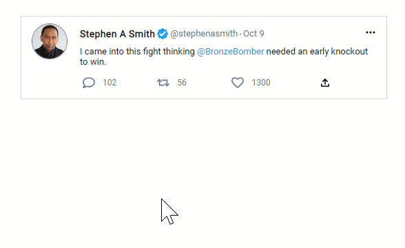

<h1 align="center">Welcome to Twitter Card Copy with React 👋</h1>
<p>
  
</p>

> Front-end copy of a Twitter card using React.

## Install

```sh
yarn install
```

## Usage

```sh
yarn run start
```

## Visuals

<br>

## Author

👤 **Jeremy Soroka**

* Github: [@jersoroka](https://github.com/jersoroka)


## Show your support

Give a ⭐️ if this project helped you!

***
_This README was generated with ❤️ by [readme-md-generator](https://github.com/kefranabg/readme-md-generator)_